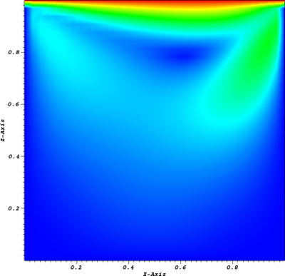
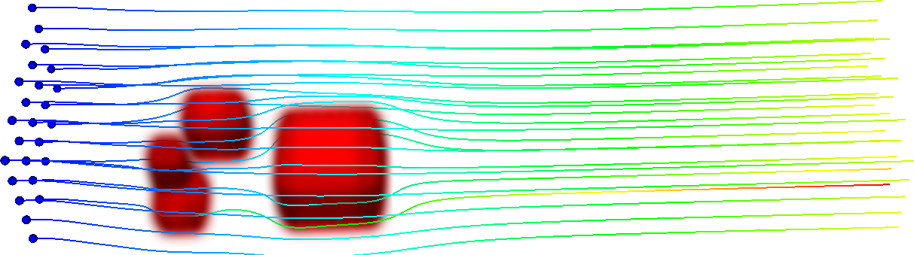

Title: FFD library readme file
Author: Lukas Bystricky
Date: August 17th, 2016

# FAST FLUID DYNAMICS LIBRARY

This is a C# implementation of the fast fluid dynamics algorithm (FFD) described by [Jos Stam](http://www.dgp.toronto.edu/people/stam/reality/Research/pdf/ns.pdf). This code has been written as part of the Google Summer of Code with Christoph Waibel of [EMPA](https://www.empa.ch/web/empa/) as a mentor. The goal of this project was to use FFD to quickly analyze in 3D the effects of urban windflow on natural ventilation of buildings. 

## Code Description

### `FluidSolver.cs`

The FluidSolver class contains all the functions needed to advance a simulation 1 time step. To initialize it you must provide:

1. The initial velocity in each coordinate direction (`u0[, ,]`, `v0[, ,]` and `w0[, ,]`)
2. A domain (inherited from `Domain.cs`) that contains information about the mesh, obstacles and boundary conditions
3. A time step size
4. A viscosity
5. A `solver_struct` that contains:
    * solver tolerance
    * maximum and minimum number of iterations
    * backtrace order (1 or 2)
    * flag to indicate verbose console output

Since we are using a staggered grid for our finite difference scheme the sizes of the arrays can be confusing. Let us consider a domain which we wish to split into `Nx` cells in the x-direction, `Ny` cells in the y-direction and `Nz` cells in the z direction. Since we have a layer of ghost cells around our domain, in order to construct such a domain we would need a computational domain with `Nx+2`, `Ny+2` and `Nz+2` cells in the x, y and z directions. The centre of each of these cells will contain a pressure value.

The velocity values are defined on middle of the cell faces normal to their direction. This means that our velocity arrays will have the following sizes:

* `u`: `Nx+1`, `Ny+2`, `Nz+2`
* `v`: `Nx+2`, `Ny+1`, `Nz+2`
* `w`: `Nx+2`, `Ny+2`, `Nz+1`

### `Domain.cs`

The Domain class contains information about the computaional domain such as the domain size, the mesh size, obstacles, boundary conditions and exact solutions (if they exist). As mentioned above, in order to properly handle boundary conditions, there is a layer of ghost cells around the domain. These cells are marked as obstacle cells, even if the boundary is not a physical obstacle (i.e. inflow or outflow). The function `set_ghost_flags()` sets these cells and flags adjacent cells as the appropriate boundary cells when the Domain is constructed. 

The function `add_obstacle(xmin, xmax, ymin, ymax, zmin, zmax)` marks all cells inside the box [`xmin`, `xmax`] X [`ymin`, `ymax`] X [`zmin`, `zmax`] as obstacles and flags adjacent cells as the the appropriate boundary.

If an exact solution is known, the function `exact_solution(...)` in the base class can be overwritten to compute it. This can be used to perform convergence studies.

### `PostProcessor.cs`

The PostProcessor class contains routines to export the data (velocity, pressure, errors, geometry information) to [VTK](http://www.vtk.org/) files. This data can then be analyzed or plotted using such programs as [VisIt](https://wci.llnl.gov/simulation/computer-codes/visit/) or [ParaView] (http://www.paraview.org/). 

Cross section of velocity magnitude of lid driven cavity at RE=100. 

Streamlines of wind flow past 3 buildings.

